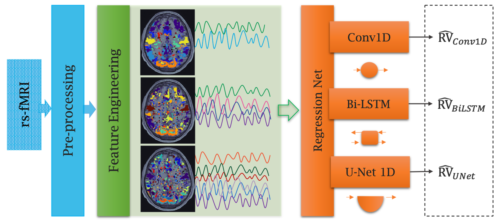

# Deep Physio Reconstruction

## Respiratory Volume (RV) Signal Reconstruction from fMRI Data




Public Pytorch implementation for the **A Deep Pattern Recognition Approach for Inferring
Respiratory Volume Fluctuations from fMRI Data** paper, which was accepted to [MICCAI 2020](https://www.miccai2020.org/en/).


If you find this code helpful in your research please cite the following paper:

```
TBA
```

The paper can be found [TBA]().

**Abstract**: Functional magnetic resonance imaging (fMRI) is one of the most
widely used non-invasive techniques for investigating human brain activity. Yet,
in addition to local neural activity, fMRI signals can be substantially influenced
by non-local physiological effects stemming from processes such as slow
changes in respiratory volume (RV) over time. While external monitoring of 
respiration is currently relied upon for quantifying RV and reducing its effects 
during fMRI scans, these measurements are not always available or of sufficient
quality. Here, we propose an end-to-end procedure for modeling fMRI effects
linked with RV, in the common scenario of missing respiration data. We compare
the performance of multiple deep learning models in reconstructing missing RV
data based on fMRI spatiotemporal patterns. Finally, we demonstrate how the
inference of missing RV data may improve the quality of resting-state fMRI 
analysis by directly accounting for signal variations associated with slow changes in
the depth of breathing over time.

Author of this code:
- Roza G. Bayrak ([email](mailto:roza.g.bayrak@vanderbilt.edu))

## Results

Direct comparison of predicted and "ground truth" (measured) RV.


Percentage of temporal variance explained by "ground truth" RV and predicted RV at each fMRI voxel, for the same scans shown in figure above.


